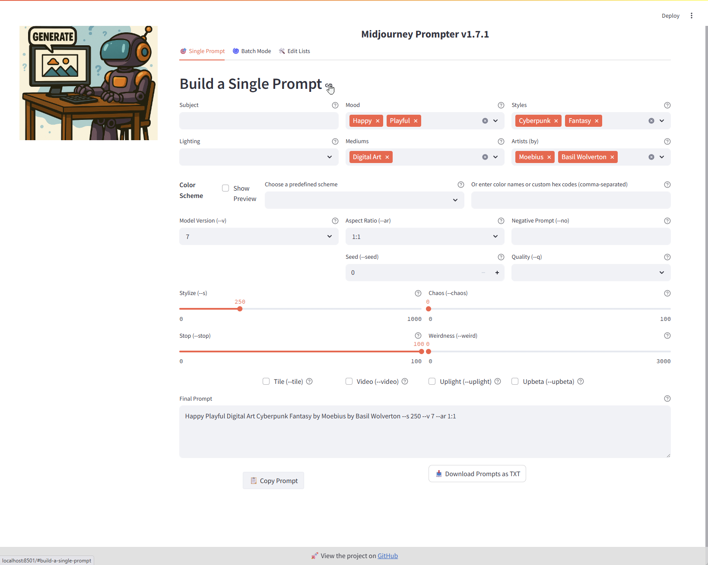
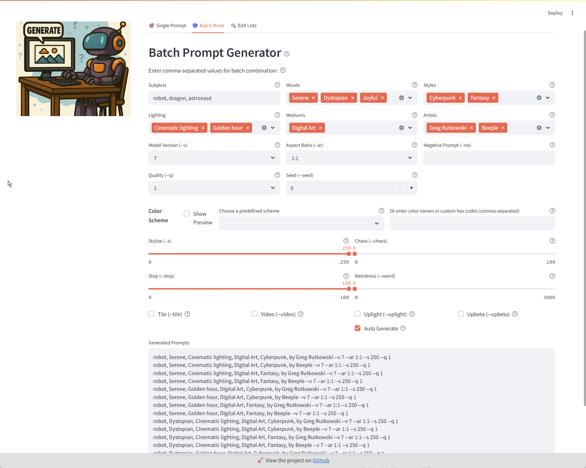
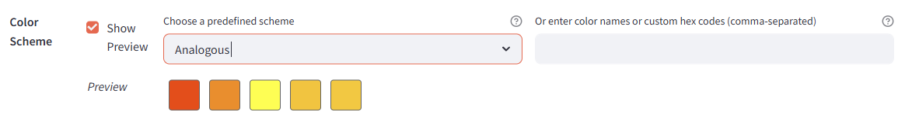
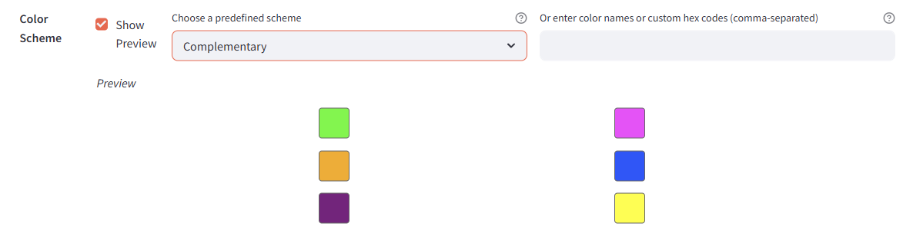

Welcome to **Prompt Forge**, an interactive application designed to help you craft, preview, and manage prompts efficiently for creative projects. This user manual will guide you through all the features and how to use them effectively within the app.

---

## Live Streamlit Example

You can try the live version of the app here:  
[https://promptforgeapp.streamlit.app/](https://promptforgeapp.streamlit.app/)

If you're tech-savvy and want to run the app locally, follow the installation instructions below. 
Or you can use the live version to explore the features without any setup. 
Or even better, check out the repo, sign in to Streamlit and with your GitHub account and host your own version of the app!
Repo is available here:  
[https://github.com/lelandg/promptforge/](https://github.com/lelandg/promptforge/)

---

## Overview

# Prompt Forge provides a user-friendly interface split into three main tabs, each with distinct functionality to support prompt creation and customization:

The repo was originally named MidjourneyPrompter because I cloned a site named "Midjourney Prompter" by Shane McGeehan. He took the site down, but I thought it was a great idea and wanted to keep it alive. I added some features and made it my own, but the original idea is his. After I got it online, he reached out to me and said he was glad I did that. However, he asked me to rename it. So I renamed the front-facing portion. So, I hope you enjoy it!

Prompt Forge 
- **Main Prompt Builder**  
- **Batch Prompt Generator**  
- **Color Scheme Generator**  

Each tab includes interactive controls and previews to enhance your creative workflow.

---

## Tab 1: Main Prompt Builder

This tab allows you to build individual creative prompts by selecting and customizing various parameters such as:

- **Subjects:** Choose the theme or main subject of your prompt.  
- **Artists:** Select inspiration styles based on famous artists.  
- **Styles, Mediums, Moods, Lighting, Colors:** Customize the artistic style, medium, emotion, lighting, and palette of the creation.  
- **Aspect Ratio and Version:** Set the image dimensions and rendering version.  
- **Parameters:** Adjust quality, chaos, stylize, seed, and other fine controls.  
- **Preview:** Instantly see a generated preview of your current prompt.  
- **Copy and Export:** Easily copy the prompt text or export your prompt for further use. 
- **Single Prompt Screenshot:**
  

---

## Tab 2: Batch Prompt Generator

Use this tab to generate multiple prompts in one go, ideal for bulk creative exploration. Features include:

- **Batch Settings:** Define batches of subjects, moods, styles, lighting, colors, and more to automatically combine into prompts.  
- **Control Parameters:** Customize the degree of randomness and other generation parameters for batch outputs.  
- **Auto-generate:** Quickly produce varied prompts based on selected batches.  
- **Export Options:** Export batch results as text or CSV for easy integration into other tools.
- **Batch Mode Screenshot:**
  

---

## Tab 3: Color Scheme Generator

Perfect for artists and designers who want to explore and create harmonious color palettes to include in their prompts:

- **Color Selection:** Choose from predefined color schemes or customize your own set of colors.  
- **Preview Palettes:** Visual previews of color combinations with adjustable parameters.  
- **Copy Palette:** Copy the generated color scheme description for use in creative prompts.  
- **Integration:** Easily integrate your generated colors into the prompt builder.
- **Screenshots**: 
  - You can **see the color scheme** preview when you enable "Show Preview" in the color scheme section.
  
  - When you select **`Complementary`**, the colors are **grouped into complementary pairs**, and the preview shows the color scheme description and the color palette preview.
  

---

## How to Use Prompt Forge

1. **Open the app** using the live Streamlit link or install locally following the installation instructions below.  
2. **Select a tab** based on your task: create a single prompt, generate batches, or design color schemes.  
3. **Make your selections** in the provided dropdowns, sliders, and checkboxes to customize your prompt or batch.  
4. **Preview your prompt** in real-time (available in the first and third tabs).  
5. **Copy, export, or save** your generated prompt(s) for further use in your workflows.

---

## Installation (Optional for local use)

If you'd like to run the app locally:

1. Clone the repository  
   ```bash
   git clone https://github.com/lelandg/promptforge.git
   cd promptforge
   ```
2. Create and activate a virtual environment (recommended)  
   ```bash
   python -m venv venv
   venv\Scripts\activate  # On Windows
   # Or
   source venv/bin/activate  # On macOS/Linux
   ```
3. Install dependencies  
   ```bash
   pip install -r requirements.txt
   ```
4. Run the app  
   ```bash
   streamlit run app.py
   ```

---

## Additional Notes

- The app provides multiple configurable parameters to fine-tune prompts, including negative prompts and advanced settings for creative control.  
- You can export your prompts in formats suitable for direct use or integration with other creative platforms.  
- The interface supports copy-to-clipboard functionality to speed up your workflow.

---

## Feedback and Contribution

Feel free to contribute improvements or report issues on the project’s GitHub repository. Your feedback helps enhance the app’s usability and functionality.

---

Thank you for using Prompt Forge! Enjoy creating inspiring prompts with ease.

### ToDo
- [ ] Update this README with more details
- [ ] Write use cases for each tab
- [ ] Add more examples
